# P3 图文精解：名词术语大全 + Mermaid 可视化

> **整合**：`P3-零基础完整教学文档.md` + `P3-深度展开-完整技术剖析.md` + `P3-代码完全注解版.md`
> **内容**：所有专业名词详解 + 所有 ASCII 图 → Mermaid 代码（可直接渲染为图像）
> **作者**：WorkBuddy | 2026-06-23

---

# 目录

1. [核心名词术语大全](#一核心名词术语大全)
2. [系统全景 Mermaid 图解](#二系统全景-mermaid-图解)
3. [消息流 Mermaid 图解](#三消息流-mermaid-图解)
4. [状态机 Mermaid 图解](#四状态机-mermaid-图解)
5. [算法流程 Mermaid 图解](#五算法流程-mermaid-图解)
6. [数据结构 Mermaid 图解](#六数据结构-mermaid-图解)
7. [并发模型 Mermaid 图解](#七并发模型-mermaid-图解)
8. [完整任务生命周期时序图](#八完整任务生命周期时序图)

---

# 一、核心名词术语大全

## 1.1 架构与设计模式

### 黑板模式（Blackboard Pattern）
一种软件架构模式。多个独立的"知识源"（模块）通过一个共享的"黑板"（共享存储）交换信息，各模块之间不直接通信。好处是模块完全解耦，一个模块崩溃不影响其他模块。

> 项目体现：Redis 是黑板，所有模块只读写 Redis，模块间无直接调用。

### C2 架构（Command and Control）
源自军事指挥体系。由一个中央控制器（C）向多个执行器（2...N）下发命令，执行器不主动行动。Controller 是唯一的大脑。

> 项目体现：Controller 下达 NAVIGATE/MOVE_STEP/FORWARD_CONFIG 命令，其他模块被动响应。

### 分布式锁（Distributed Lock）
在多进程/多机器环境下，确保同一时刻只有一个进程能执行某段代码。基于 Redis SET NX EX 实现：NX(Not eXists) 保证互斥，EX(Expire) 设置过期时间防止死锁。

### 拉式任务驱动（Pull-based Task Queue）
消费者主动从队列拉取任务，而不是被推送。好处是消费者可以控制处理速度，防止过载。

> 项目体现：Controller 通过 BLPOP 从 Redis List 拉任务，而非订阅 RabbitMQ 队列被推送。

### 事件驱动（Event-driven）
程序的执行流程由"事件"（消息到达、用户点击、定时器触发）驱动，而非按预设顺序执行。

> 项目体现：TaskConfigurator 通过 RabbitMQ DeliverCallback 回调被触发；Controller 通过 tick 定时器和 Redis 轮询触发。

---

## 1.2 中间件与基础设施

### Redis
开源的内存数据结构存储系统，支持 String/Hash/List/Set/Bitmap 等多种数据结构。所有数据在内存中，读写极快（微秒级）。支持持久化到磁盘（RDB 快照）。

**本项目中的 5 种用法：**

| 数据结构 | 用途 | Redis 命令 |
|---------|------|-----------|
| **String (BIT)** | 地图探索/障碍物 bitmap | SETBIT / GETBIT / BITCOUNT |
| **Hash** | 小车位置 {x, y}、任务配置 | HSET / HGET / HGETALL |
| **List** | 任务队列、小车路径、回放快照 | RPUSH / LPOP / BLPOP / LRANGE |
| **Set** | 未探索坐标索引 ("x,y") | SADD / SREM / SRANDMEMBER / SCARD |
| **String (lock)** | 分布式锁 | SET NX EX / DEL |

### Redis Pipeline
将多条 Redis 命令在客户端缓冲，一次性发送给服务端执行，再一次性接收结果。减少网络往返次数，大幅提升批量操作性能。

### Redis bitmap
Redis 的位图数据结构。每个 bit 存储一个布尔值（0/1），通过 `SETBIT key offset value` 设置，`GETBIT key offset` 读取，`BITCOUNT key` 统计 1 的数量。

> 项目体现：40×40=1600 格，只需 200 字节，O(1) 读写单格，O(字节数) 统计。

### Redis BGSAVE
Redis 的后台持久化命令。fork 子进程将当前内存数据写入 RDB 文件，主进程继续服务，不阻塞。

### 版本号缓存（Version-based Cache）
一种缓存失效策略。写入数据时递增版本号，读取时对比缓存的版本号：相同则直接返回缓存，不同则重新读取。避免高频率重复读取不变的数据。

> 项目体现：map:view bitmap 每 100ms 读取一次，但只在车移动时才变化，版本号缓存将性能提升 100x。

### RabbitMQ
开源的消息队列中间件。生产者向 Exchange 发消息，Exchange 按规则路由到 Queue，消费者从 Queue 拉消息。

**本项目中的核心概念：**

| 概念 | 解释 | 项目中的例子 |
|------|------|------------|
| **Exchange** | 消息交换机，接收消息并路由到队列 | UpdateView(Fanout) |
| **Queue** | 消息队列，存储消息直到被消费 | Navigator4CarID, Car:Car001 |
| **Fanout Exchange** | 广播模式：消息发给所有绑定的队列 | Display 同步刷新 |
| **Consumer** | 消费者，从队列取消息处理 | Navigator, Car |
| **basicAck** | 手动确认：消费者处理完后告知 RabbitMQ | TaskConfigurator 防消息丢失 |
| **durable** | 持久化：RabbitMQ 重启后队列/消息不丢失 | 所有队列都是 durable=true |

### RabbitMQ 自动恢复（Automatic Recovery）
RabbitMQ 客户端的功能：当连接意外断开后自动重连并恢复队列/Exchange 绑定，无需手动干预。

### RabbitMQ 公平分发（basicQos）
`basicQos(1)` 告诉 RabbitMQ 每次只给一个消费者发一条消息，处理完确认后再发下一条。避免忙的消费者更忙、闲的更闲。

---

## 1.3 Java 并发

### volatile 关键字
Java 的关键字。修饰变量时，保证该变量的读写对所有线程立即可见（强制从主内存读写，而非 CPU 缓存）。用于多线程共享的布尔标志。

> 项目体现：ControllerAgent 的 `running`、`taskActive`、`recording` 都被不同线程读写，必须加 volatile。

### synchronized 关键字
Java 的内置锁机制。`synchronized(obj) { ... }` 表示只有获取 obj 监视器锁的线程才能进入代码块。

### wait / notify / notifyAll
Java 线程间的等待/通知机制。

- `obj.wait()`：当前线程释放 obj 的锁，进入 WAITING 状态（休眠）
- `obj.notifyAll()`：唤醒所有在 obj 上等待的线程

> 项目体现：taskProcessLoop 在 taskActive=false 时 wait(1000)，handleStartTask 调用 notifyAll 立即唤醒。

### 守护线程（Daemon Thread）
Java 的一种线程类型。当所有非守护线程结束时，JVM 自动退出，不等待守护线程。`thread.setDaemon(true)` 设置。

> 项目体现：taskProcessor 是守护线程，避免 JVM 无法退出。

### ScheduledExecutorService
Java 的定时任务调度器。`scheduleAtFixedRate(task, delay, period, unit)` 以固定频率执行任务。

> 项目体现：broadcastScheduler 每 100ms 执行一次 broadcastTick。

### try-with-resources
Java 7+ 的语法糖。`try (Resource r = ...) { ... }` 中的资源在代码块结束后自动调用 `close()`，无论是否异常。

> 项目体现：`try (Jedis jedis = pool.getResource())` 自动归还 Redis 连接。

### Lambda 表达式
Java 8+ 的函数式编程语法。`(参数) -> { 函数体 }`，用于简化匿名类的写法。

> 项目体现：`DeliverCallback cb = (tag, delivery) -> { ... }` 等价于匿名内部类。

---

## 1.4 算法与数据结构

### BFS（广度优先搜索）
从起点开始，按"距离层"逐层扩展访问所有可达节点的图搜索算法。普通 BFS 所有边权为 1，保证找到最短路径。

### 0-1 BFS
BFS 的变种。边权只有 0 和 1。使用双端队列（Deque）：cost=0 的节点放队头优先处理，cost=1 的放队尾。时间复杂度 O(V)，比 Dijkstra 快。

> 项目体现：未探索格 cost=0（优先走），已探索格 cost=1（不优先），同时保证整体路径最短。

### 曼哈顿距离（Manhattan Distance）
网格地图上的距离：`|x1-x2| + |y1-y2|`。因为不能斜走，总步数 = 水平差 + 垂直差。

### 贪心算法（Greedy Algorithm）
每一步都选当前最优解，不保证全局最优。优点是计算开销极小。

> 项目体现：TargetPlanner 每次选最近未探索格作为目标。

### 拒绝采样（Rejection Sampling）
随机生成候选，检查是否符合条件，不符合则拒绝对重新生成。适合约束条件下生成随机样本。

> 项目体现：障碍物随机生成时，每次随机选坐标，检查是否在禁区，不在才接受。

### 两步前瞻（Two-step Lookahead）
在做出决策前不仅检查下一步，还检查第二步。如果第二步有问题（障碍物），提前终止当前路径。

> 项目体现：Car 移动前 peek 第二步，如有障碍则清空剩余路径，避免无意义的移动。

### 网格分区（Grid Partitioning）
将矩形地图划分为规则网格，每个格子放置一个对象。确保对象均匀分布。

> 项目体现：出生点计算 `cols=⌈√N⌉, rows=⌈N/cols⌉`，每辆车放在对应格子的中心。

---

## 1.5 系统设计名词

### FIFO（First In, First Out）
先进先出。队列的一种特性：先入队的元素先出队。

> 项目体现：Redis List RPUSH(入队尾) + LPOP(出队头) 实现 taskQueue。

### BLPOP（Blocking Left Pop）
Redis 的阻塞式列表弹出命令。如果 List 为空，客户端阻塞等待直到有新元素或超时。实现事件驱动架构的关键。

### 轮询（Polling）
定期检查某个条件是否满足。优点是简单，缺点是有延迟和 CPU 浪费。

> 项目体现：taskProcessLoop 每 1 秒轮询 Redis taskActive（混合了事件唤醒）。

### 连续清空（Drain Loop）
处理完一条消息后，继续用非阻塞方式清空队列中的剩余消息，避免积压。

> 项目体现：BLPOP 拉一条 + while(popTask()!=null) 连续清空。

### 崩溃恢复（Crash Recovery）
模块崩溃后重启时，能够正确恢复状态继续工作，不破坏已有数据。

> 项目体现：TaskConfigurator 重启时检测 existingConfig，跳过初始化，触发 BGSAVE。

### 多实例分片（Multi-instance Sharding）
多个相同的服务实例通过某种规则（如取模）瓜分工作负载，互不冲突。

> 项目体现：Controller 通过 `carIndex % totalInstances == instanceId` 分片管理小车。

### 双保险判定（Double-check Completion）
用两个独立的指标（SCARD + BITCOUNT）来判断任务是否完成，防止单一指标失效导致误判。

### 双层暂停（Two-level Pause）
全局暂停（配置员）覆盖个人暂停（运行员）。先检查全局，再检查个人。

### 幂等操作（Idempotent）
多次执行与一次执行效果相同的操作。

> 项目体现：`queueDeclare` 声明已存在的队列不是错误。

---

# 二、系统全景 Mermaid 图解

## 2.1 整体架构总览

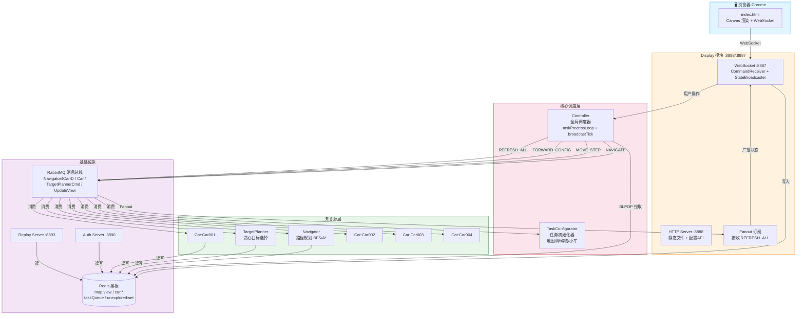

## 2.2 P3 职责边界图

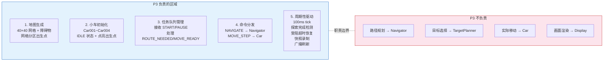

---

# 三、消息流 Mermaid 图解

## 3.1 完整消息流转（从点击"开始"到探索完成）

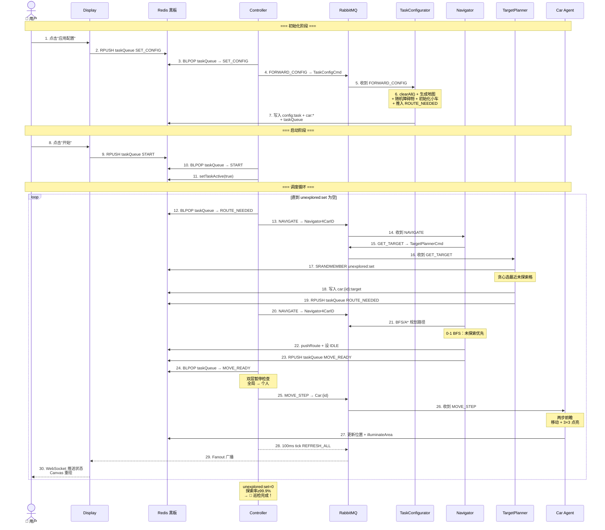

## 3.2 P3 内部消息路由（Controller 的任务分发）

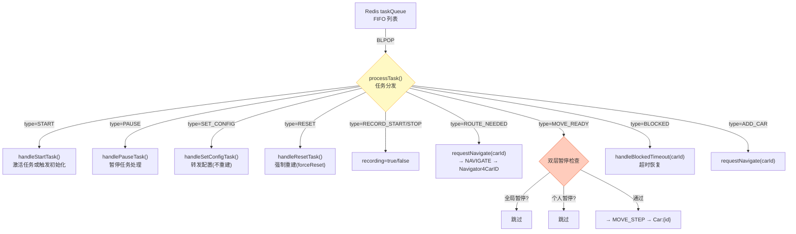

## 3.3 TaskConfigurator 的 handleForwardConfig 三路分发

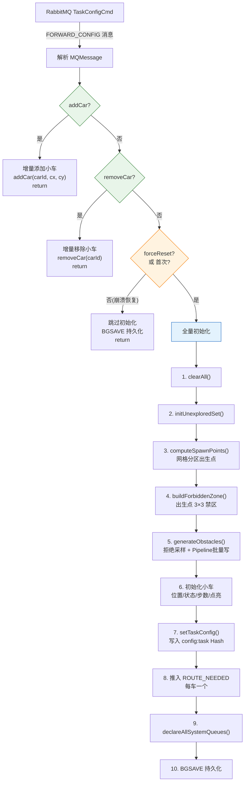

---

# 四、状态机 Mermaid 图解

## 4.1 小车三状态流转

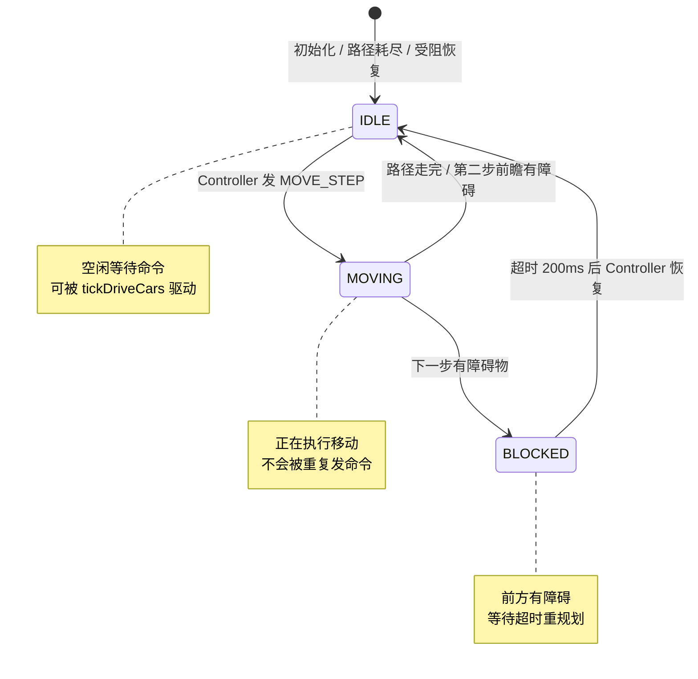

## 4.2 taskActive 激活状态机

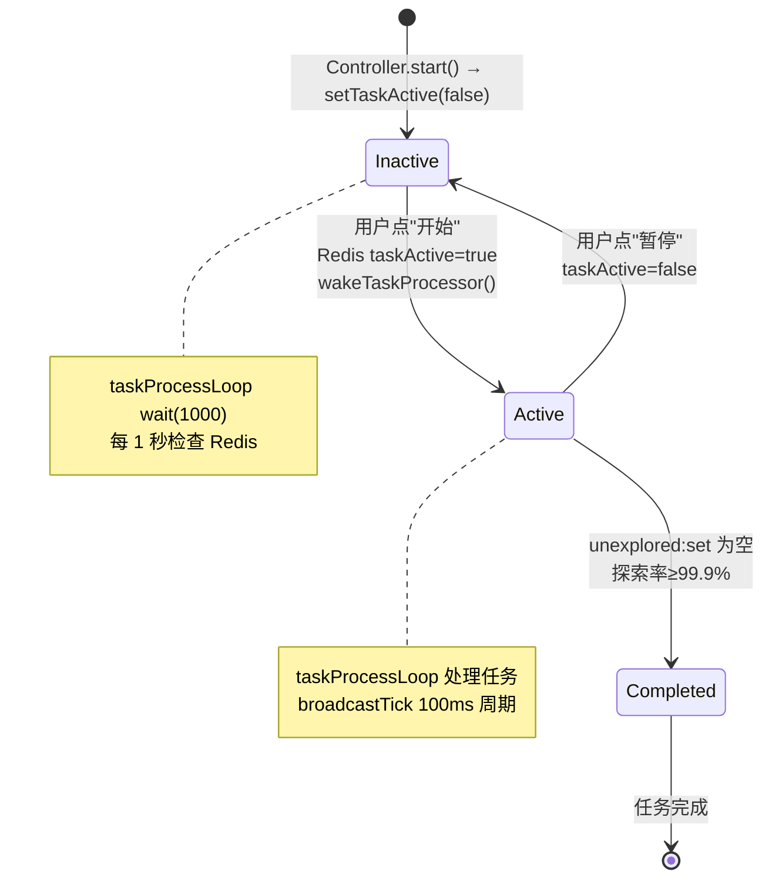

## 4.3 小车状态 + 任务类型联合状态机

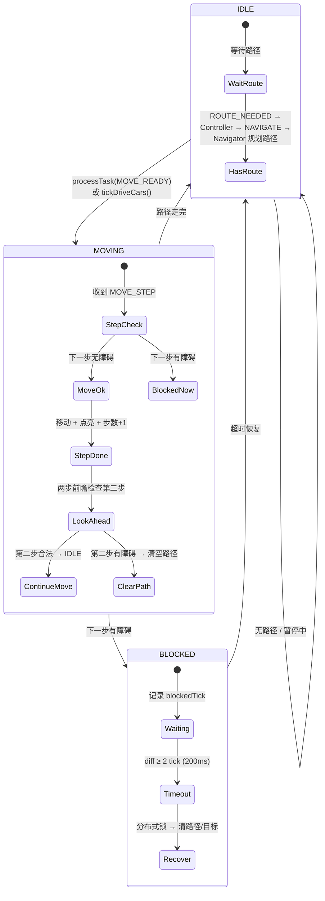

## 4.4 完整任务生命周期

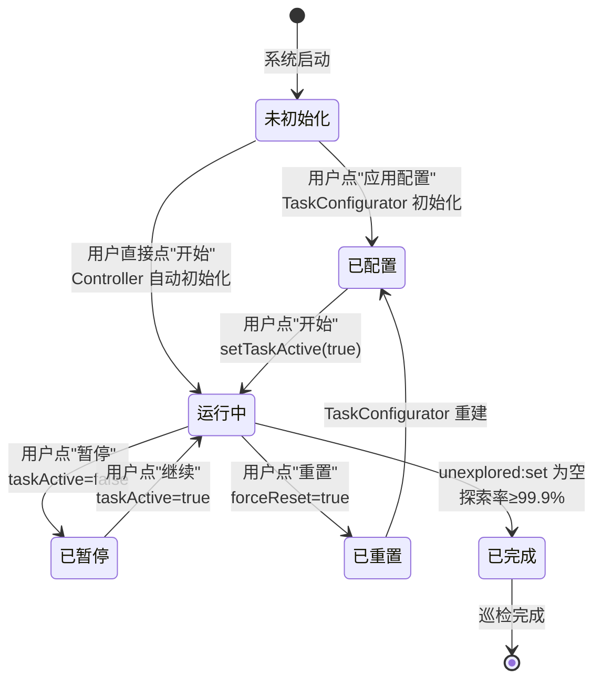

---

# 五、算法流程 Mermaid 图解

## 5.1 网格分区出生点算法（computeSpawnPoints）

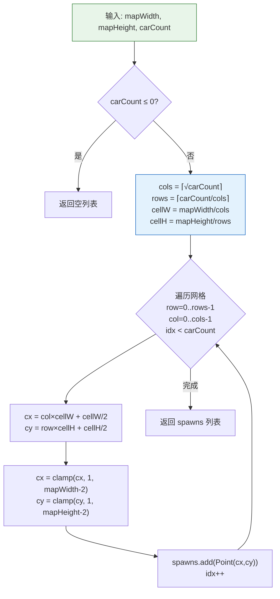

## 5.2 障碍物拒绝采样算法（generateObstacles）

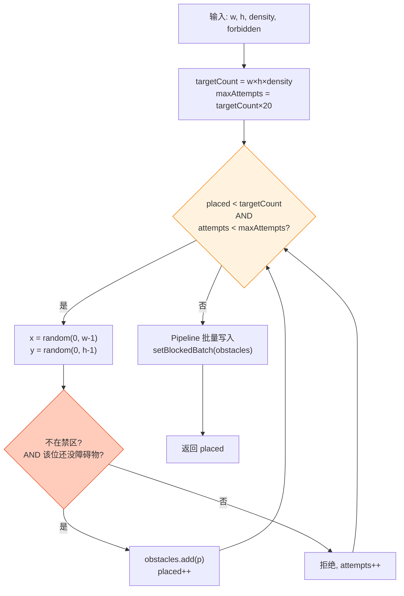

## 5.3 0-1 BFS 寻路算法

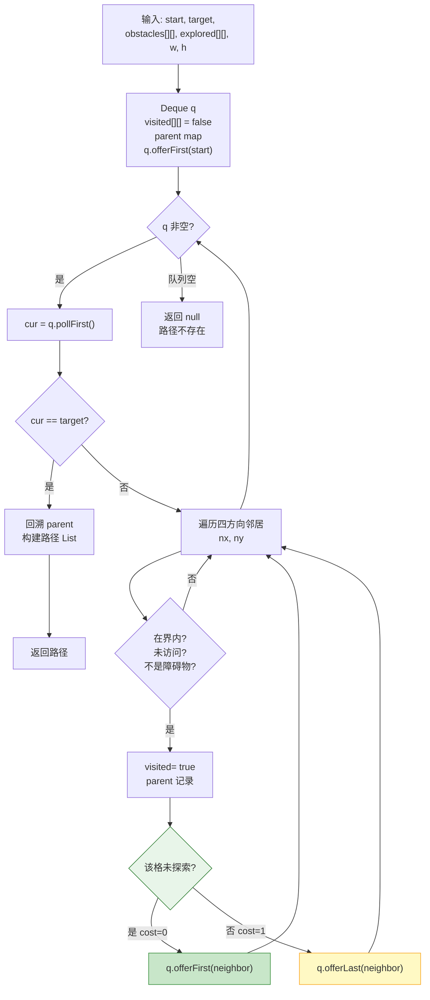

## 5.4 两步前瞻机制

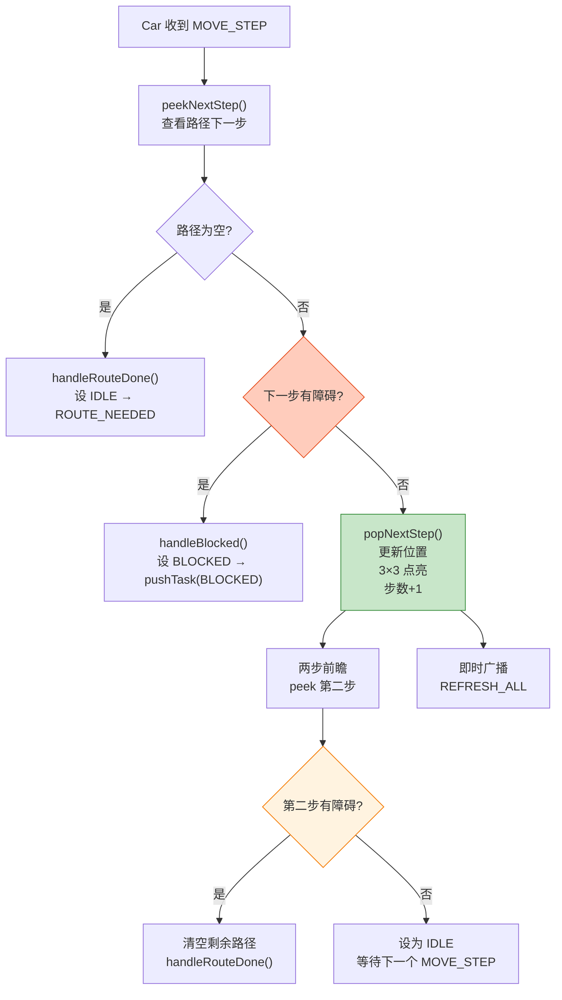

---

# 六、数据结构 Mermaid 图解

## 6.1 Redis 黑板上的数据全景

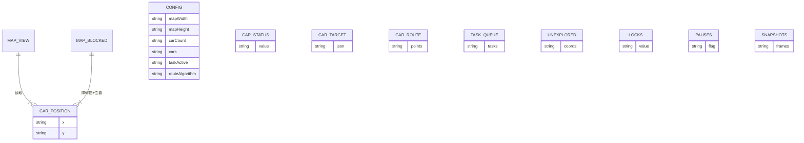

## 6.2 bitmap 坐标到偏移的映射

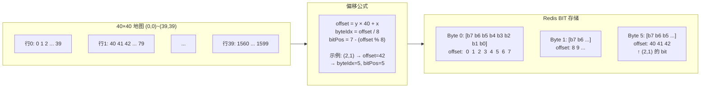

## 6.3 taskQueue 的 LPOP/RPUSH 队列操作

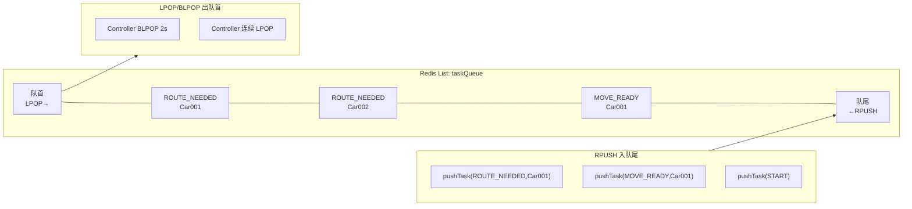

---

# 七、并发模型 Mermaid 图解

## 7.1 Controller 双线程架构

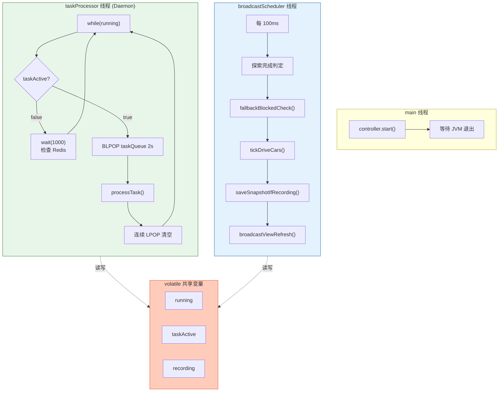

## 7.2 分布式锁的获取与释放

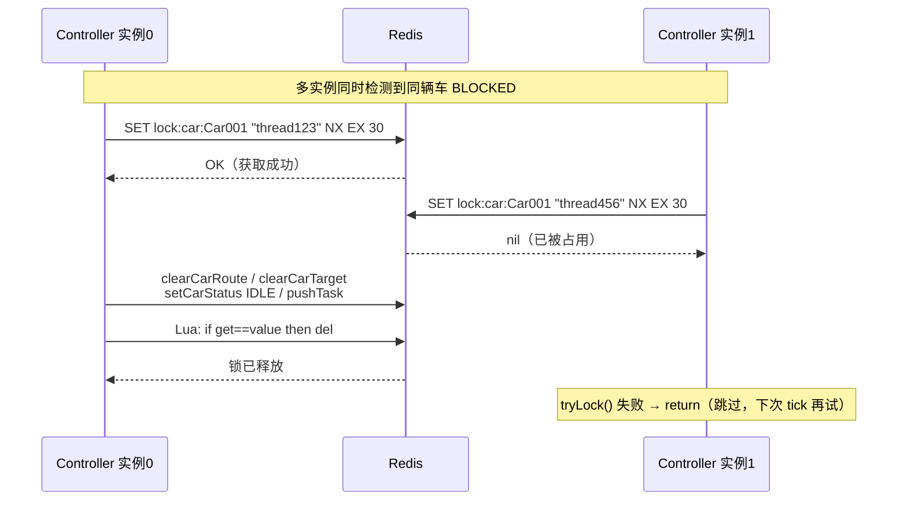

---

# 八、完整任务生命周期时序图

## 8.1 从启动到探索完成的完整消息序列

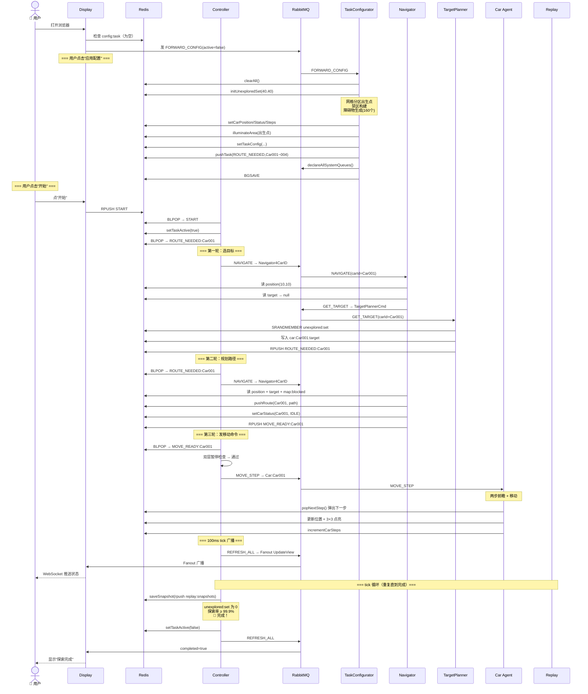

---

# 附录：Mermaid 图表索引

| 编号 | 图表名称 | 类型 | 所属章节 |
|------|---------|------|---------|
| 1 | 整体架构总览 | graph TB | 2.1 |
| 2 | P3 职责边界图 | graph LR | 2.2 |
| 3 | 完整消息流转时序 | sequenceDiagram | 3.1 |
| 4 | Controller 任务分发 | graph TD | 3.2 |
| 5 | TaskConfigurator 三路分发 | graph TD | 3.3 |
| 6 | 小车三状态流转 | stateDiagram | 4.1 |
| 7 | taskActive 激活状态机 | stateDiagram | 4.2 |
| 8 | 小车+任务联合状态机 | stateDiagram | 4.3 |
| 9 | 完整任务生命周期 | stateDiagram | 4.4 |
| 10 | 网格分区出生点算法 | graph TD | 5.1 |
| 11 | 障碍物拒绝采样算法 | graph TD | 5.2 |
| 12 | 0-1 BFS 寻路算法 | graph TD | 5.3 |
| 13 | 两步前瞻机制 | graph TD | 5.4 |
| 14 | Redis 数据全景 ER 图 | erDiagram | 6.1 |
| 15 | bitmap 坐标映射 | graph LR | 6.2 |
| 16 | taskQueue 队列操作 | graph LR | 6.3 |
| 17 | Controller 双线程架构 | graph TB | 7.1 |
| 18 | 分布式锁获取释放 | sequenceDiagram | 7.2 |
| 19 | 完整任务生命周期时序 | sequenceDiagram | 8.1 |

---

*文档版本 v1.0 — 2026-06-23*
